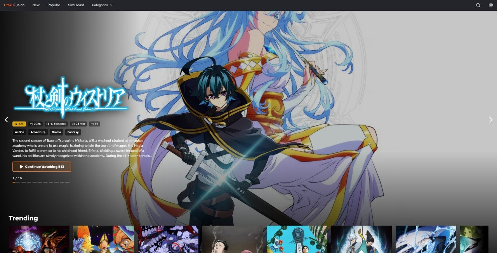
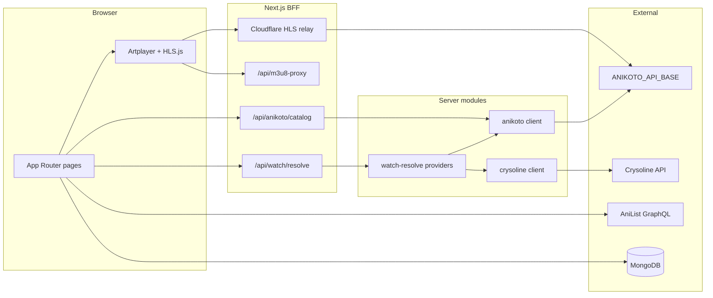

<div align="center">

# OtakuFusion

**A modern anime streaming web app** — discovery, a custom HLS player, and multi-provider playback in one UI.

[](https://nextjs.org/)
[](https://react.dev/)
[](https://www.typescriptlang.org/)
[](LICENSE)
[](https://github.com/Pashahu1/OtakuFusion/actions/workflows/ci.yml)
[](https://otaku-fusion.vercel.app/)

[Live demo](https://otaku-fusion.vercel.app/) · [Features](#features) · [Screenshots](#screenshots) · [Quick start](#quick-start) · [Known limitations](#known-limitations) · [Deploy](#deployment-vercel)

</div>



---

## Overview

OtakuFusion is a full-stack **Next.js** app for browsing and watching anime. Metadata comes from **AniList**; streams are resolved **server-side** through provider-specific BFF routes and **`/api/watch/resolve`**. Playback uses **Artplayer** + **HLS.js**, with an optional **Cloudflare HLS relay** for Anikoto CDN segments that need Referer/CORS proxying.

**Live demo:** [https://otaku-fusion.vercel.app/](https://otaku-fusion.vercel.app/)

---

## Playback providers

| Language / track | Provider | Backend |
|------------------|----------|---------|
| **Japanese (Sub)** | **Anikoto** | `ANIKOTO_API_BASE` → BFF `/api/anikoto/*` |
| **English (Dub)** | **Anikoto** | same (sub→dub fallback on resolve when needed) |
| **Ukrainian** | Anilibria | [Crysoline API](https://docs.crysoline.moe/) |
| **Optional** | Hikka | direct or `HIKKA_FEATURES_RELAY_BASE` on Vercel |

**Default watch provider** for new sessions is **Anikoto** (Japanese / English). Users can switch language in the player; **Continue watching** restores saved provider, dub/sub, and playback position.

### Anikoto HLS notes

- Resolve returns a master `.m3u8` from the Anikoto upstream CDN.
- Set **`NEXT_PUBLIC_M3U8_PROXY_BASE`** to your [Cloudflare HLS relay](workers/hls-relay/) on production — edge passthrough for disguised segment URLs and stable CORS.
- Without the relay, the app falls back to same-origin **`/api/m3u8-proxy`** (works locally; can be slower on serverless).
- Player defaults to **720p** start with automatic quality fallback when a CDN rendition returns 522/5xx.

---

## Table of contents

- [Features](#features)
- [Screenshots](#screenshots)
- [Playback providers](#playback-providers)
- [Tech stack](#tech-stack)
- [Architecture](#architecture)
- [Known limitations](#known-limitations)
- [Prerequisites](#prerequisites)
- [Quick start](#quick-start)
- [Environment variables](#environment-variables)
- [Scripts](#scripts)
- [Project structure](#project-structure)
- [Deployment (Vercel)](#deployment-vercel)
- [Contributing](#contributing)
- [Author](#author)

---

## Screenshots

The hero image at the top of this README is the **home page** (spotlight + trending).

For **watch**, **HLS playback**, and **provider switching** — open the [live demo](https://otaku-fusion.vercel.app/) and pick any title.

---

## Features

### Watch

- **Anikoto** integration — catalog, episodes, stream resolve (sub/dub)
- Custom **Artplayer** UI — HLS quality, subtitles, thumbnails, skip intro/outro
- **Continue watching** — progress, preview frames, resume position, provider/lang restore
- **Provider switch** — Anikoto ↔ Anilibria ↔ Hikka with warm catalog cache
- Server-side **stream resolve** — probing, retries, quality variants

### Discover

- Home spotlight carousel and trending rows
- Search with debounce and genre browsing
- Release schedule calendar

### Account

- Register / login with email verification (SMTP)
- Profile, optional avatar upload (Cloudinary)
- Favorites synced to MongoDB

---

## Tech stack

| Area | Technologies |
|------|----------------|
| App | Next.js 16 (App Router), React 19, TypeScript |
| Styling | Tailwind CSS 4, SCSS |
| Video | Artplayer, HLS.js, `/api/m3u8-proxy`, optional Cloudflare relay |
| Data (UI) | TanStack Query |
| Data (watch) | React hooks + `localStorage` provider mapping cache |
| API | Next.js Route Handlers, Zod |
| Auth | JWT + HTTP-only cookies |
| Database | MongoDB (Mongoose) |
| Streams | Anikoto API, Crysoline (Anilibria), Hikka |
| Tests | Vitest |

---

## Architecture



**Resolve flow (Anikoto):**

1. Client loads episodes via `POST /api/anikoto/catalog` (search + slug mapping cached in `localStorage`).
2. `GET /api/watch/resolve?provider=anikoto&lang=sub|dub` calls `ANIKOTO_API_BASE/api/stream`.
3. Player plays the HLS URL via **`NEXT_PUBLIC_M3U8_PROXY_BASE`** or `/api/m3u8-proxy`; playlists are rewritten server-side/edge-side.

---

## Known limitations

OtakuFusion is a **portfolio / viewer-focused pet project** — not a licensed streaming platform. These constraints are intentional for v1.

| Area | What to expect |
|------|----------------|
| **Third-party streams** | Playback depends on Anikoto, Crysoline (Anilibria), and Hikka. Catalog coverage and uptime are not under our control. |
| **Anikoto CDN** | Some episodes fail probe with **403/404** (`anikoto_stream_probe_failed`). Switch language or provider (UA / JP) in the player, or try another episode. |
| **HLS on Vercel** | Anikoto segments need **`NEXT_PUBLIC_M3U8_PROXY_BASE`** (Cloudflare `workers/hls-relay`). Same-origin `/api/m3u8-proxy` works locally but can be slower on serverless. |
| **Hikka on Vercel** | Upstream may block the server IP — set **`HIKKA_FEATURES_RELAY_BASE`** if Ukrainian tracks return 403. |
| **Account** | Register/login and **favorites** work; **email verification is optional** (Profile → verify when you want). |
| **Admin** | No admin panel in v1 — out of scope while the product targets viewers, not operators. |
| **Content policy** | Some titles return `CONTENT_BLOCKED` and cannot be played. |
| **Scope** | No native app, offline/PWA, or guaranteed dub/sub for every episode. Continue watching is browser `localStorage` + MongoDB favorites for logged-in users. |

For local/production setup details, see [Deployment (Vercel)](#deployment-vercel) and [Environment variables](#environment-variables).

---

## Prerequisites

| Requirement | Required? | Notes |
|-------------|-----------|--------|
| Node.js 20 LTS | Yes | |
| MongoDB | Yes | Auth, favorites |
| SMTP | Yes | Verification emails |
| `CRYSOLINE_API_KEY` | Yes | Anilibria (Ukrainian) |
| **`ANIKOTO_API_BASE`** | **Yes for JP/EN** | Server-only; use a compatible Anikoto API, e.g. `https://anikoto-api-nine.vercel.app` |
| `NEXT_PUBLIC_M3U8_PROXY_BASE` | **Strongly recommended** | Deploy `workers/hls-relay` on Cloudflare |
| `NEXT_PUBLIC_SITE_URL` | Recommended | Metadata & resolve probes |
| Cloudinary | Optional | Avatars |
| TVDB API key | Optional | Hero clear logos |
| Hikka relay worker | Optional | If Hikka blocks your host IP |

---

## Quick start

### 1. Clone & install

```bash
git clone https://github.com/Pashahu1/OtakuFusion.git
cd OtakuFusion
npm install
```

### 2. Configure environment

```bash
cp .env.example .env.local
```

**Minimum `.env.local`:**

```env
MONGODB_URI=mongodb+srv://...
NEXT_JWT_ACCESS_SECRET=   # openssl rand -base64 32
NEXT_JWT_REFRESH_SECRET=  # different random string
SMTP_HOST=
SMTP_PORT=587
SMTP_USER=
SMTP_PASS=
CRYSOLINE_API_KEY=

# Anikoto — Japanese / English playback
ANIKOTO_API_BASE=https://anikoto-api-nine.vercel.app

# Recommended for Anikoto HLS on Vercel
NEXT_PUBLIC_M3U8_PROXY_BASE=https://your-hls-relay.workers.dev
NEXT_PUBLIC_SITE_URL=http://localhost:3000
WATCH_PROBE_SKIP_VARIANT=1
```

Full reference: **[`.env.example`](.env.example)**.

### 3. Run locally

```bash
npm run dev
```

Open **[http://localhost:3000](http://localhost:3000)**.

### 4. Optional: deploy HLS relay

```bash
cd workers/hls-relay
npx wrangler deploy
```

Set `NEXT_PUBLIC_M3U8_PROXY_BASE` to the worker URL, then redeploy OtakuFusion.

### 5. Pre-deploy check

```bash
npm run predeploy
```

---

## Environment variables

### Required

| Variable | Purpose |
|----------|---------|
| `MONGODB_URI` | Database |
| `NEXT_JWT_ACCESS_SECRET` / `NEXT_JWT_REFRESH_SECRET` | Auth tokens |
| `SMTP_*` | Email |
| `CRYSOLINE_API_KEY` | Anilibria catalog & resolve |

### Required for Anikoto (Japanese / English)

| Variable | Purpose |
|----------|---------|
| `ANIKOTO_API_BASE` | Upstream Anikoto API (server-only). Example: `https://anikoto-api-nine.vercel.app` |
| `ANIKOTO_FETCH_TIMEOUT_MS` | Optional; default `28000` |

### Recommended on Vercel

| Variable | Purpose |
|----------|---------|
| `NEXT_PUBLIC_SITE_URL` | Canonical production URL |
| `NEXT_PUBLIC_M3U8_PROXY_BASE` | Cloudflare HLS relay for Anikoto segments |
| `WATCH_PROBE_SKIP_VARIANT=1` | Faster watch resolve |

### Optional

| Variable | Purpose |
|----------|---------|
| `CRYSOLINE_API_BASE_URL` | Custom Crysoline host |
| `NEXT_PUBLIC_HLS_DIRECT_HOST_SUFFIXES` | CDN hosts that skip proxy (e.g. Crysoline) |
| `HIKKA_FEATURES_RELAY_BASE` | Hikka relay worker |
| `TVDB_API_KEY` | Hero artwork |
| `CLOUDINARY_*` | Avatar upload |

Never commit `.env` or secrets. Use **`.env.local`** for development.

---

## Scripts

| Command | Description |
|---------|-------------|
| `npm run dev` | Development server |
| `npm run build` | Production build |
| `npm run start` | Serve production build |
| `npm run lint` | ESLint |
| `npm run test` | Vitest |
| `npm run predeploy` | lint → tsc → test → build |
| `npm run analyze` | Bundle analyzer |

---

## Project structure

```
src/
├── app/api/
│   ├── anikoto/              # Catalog, episodes, stream BFF
│   ├── watch/resolve/
│   ├── m3u8-proxy/
│   ├── aniliberty/
│   └── hikka/
├── features/
│   ├── watch/                # useWatch, provider swap, continue watching
│   └── player/               # Artplayer, HLS lifecycle, resume
├── server/
│   ├── anikoto/              # Upstream client + cache
│   ├── watch-resolve/        # anikotoResolver, anilibertyResolver, …
│   └── m3u8-proxy/
├── lib/m3u8ProxyPublicBase.ts
└── components/

workers/
├── hls-relay/                # Cloudflare — Anikoto HLS edge relay
└── hikka-features-relay/     # Optional Hikka relay
```

---

## Deployment (Vercel)

**Checklist:**

- [ ] Required env vars (MongoDB, JWT, SMTP, `CRYSOLINE_API_KEY`)
- [ ] **`ANIKOTO_API_BASE`** for Japanese / English
- [ ] **`NEXT_PUBLIC_M3U8_PROXY_BASE`** → deploy `workers/hls-relay` first
- [ ] `NEXT_PUBLIC_SITE_URL` → your production domain
- [ ] `WATCH_PROBE_SKIP_VARIANT=1`
- [ ] **Redeploy** after any `NEXT_PUBLIC_*` change

[](https://vercel.com/new/clone?repository-url=https://github.com/Pashahu1/OtakuFusion)

After deploy, verify on the [live demo](https://otaku-fusion.vercel.app/): open any title → **Japanese / Sub** → Network shows `watch/resolve` **200** and HLS requests via your relay worker.

**Smoke test checklist (≈5 min)**

- [ ] Home loads — spotlight + trending rows
- [ ] Search returns results
- [ ] Watch page — episode list loads
- [ ] Player — at least one provider/language plays HLS
- [ ] Register/login — session persists after refresh
- [ ] Favorites — add/remove syncs when logged in

---

## Contributing

1. Open an issue for bugs or ideas.
2. Fork → branch (`feat/...` or `fix/...`).
3. Run `npm run predeploy` before a PR.
4. Never paste API keys in issues or PRs.

---

## Author

**Pavlo Chudyn** — Software Engineer

[](https://github.com/Pashahu1)
[](https://www.linkedin.com/in/pavlo-chudyn-978547246)
[](https://t.me/PashaChudin)

---

<div align="center">

If OtakuFusion is useful to you, consider giving the repo a **star**.

</div>
