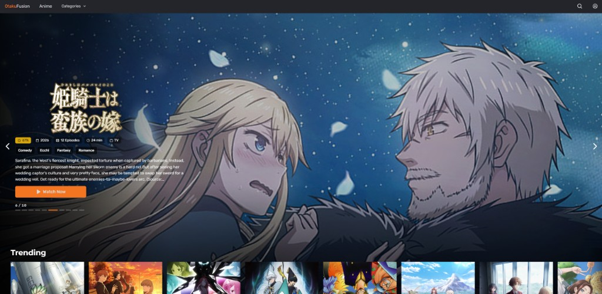
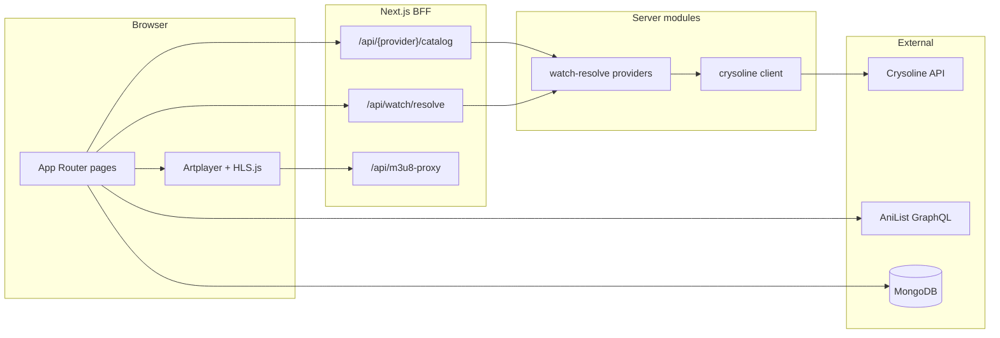

<div align="center">

# OtakuFusion

**A modern anime streaming web app** — fast discovery, a custom HLS player, and multi-source playback in one polished UI.

[](https://nextjs.org/)
[](https://react.dev/)
[](https://www.typescriptlang.org/)
[](LICENSE)

[Features](#features) · [Quick start](#quick-start) · [Environment](#environment-variables) · [Deploy](#deployment-vercel) · [Contributing](#contributing)

</div>



---

## Overview

OtakuFusion is a full-stack **Next.js** application for browsing and watching anime. Metadata comes from **AniList**; playable streams are resolved server-side through the **[Crysoline API](https://docs.crysoline.moe/)** (Animepahe, Anilibria) with optional extra providers. Playback runs in the browser via **Artplayer** and **HLS.js**, with a same-origin **`/api/m3u8-proxy`** when streams require Referer or CORS handling.

| You get | How |
|--------|-----|
| Japanese + English (sub/dub) | Animepahe via Crysoline |
| Ukrainian dub | Anilibria via Crysoline |
| Optional third source | Hikka (may need a Cloudflare relay on Vercel) |
| Accounts & favorites | MongoDB + JWT (HTTP-only cookies) |
| Hero clear logos (optional) | TheTVDB API |

---

## Table of contents

- [Features](#features)
- [Tech stack](#tech-stack)
- [Architecture](#architecture)
- [Prerequisites](#prerequisites)
- [Quick start](#quick-start)
- [Environment variables](#environment-variables)
- [Scripts](#scripts)
- [Project structure](#project-structure)
- [Deployment (Vercel)](#deployment-vercel)
- [Contributing](#contributing)
- [Author](#author)

---

## Features

### Watch

- Custom **Artplayer** UI with HLS quality switching, subtitles, thumbnails
- **Skip intro / outro** when segment hints are available
- **Continue watching** and per-episode progress
- **Provider switch** (Animepahe ↔ Anilibria ↔ Hikka) with warm catalog cache for faster swaps
- Server-side **stream resolve** with probing, retries, and quality variants

### Discover

- Home **spotlight carousel** and trending rows
- **Search** with debounce and genre browsing
- **Release schedule** calendar

### Account

- Register / login with **email verification** (SMTP)
- Profile, avatar upload (**Cloudinary**, optional)
- **Favorites** synced to your account

---

## Tech stack

| Area | Technologies |
|------|----------------|
| App | Next.js 16 (App Router), React 19, TypeScript |
| Styling | Tailwind CSS 4, SCSS |
| Video | Artplayer, HLS.js, `/api/m3u8-proxy` |
| Data (UI) | TanStack Query (home, search, details) |
| Data (watch) | React hooks + `localStorage` mapping cache |
| API layer | Next.js Route Handlers, Zod validation |
| Auth | JWT access + refresh, HTTP-only cookies |
| Database | MongoDB (Mongoose) |
| Streams | [Crysoline](https://docs.crysoline.moe/) |
| Tests | Vitest |

---

## Architecture



**Resolve flow (simplified):**

1. Client loads anime + episode list from `/api/{provider}/catalog`.
2. `GET /api/watch/resolve` picks a playable HLS URL (probe, cache).
3. Player plays the stream directly or through `/api/m3u8-proxy`.

---

## Prerequisites

| Requirement | Required? | Notes |
|-------------|-----------|--------|
| [Node.js](https://nodejs.org/) 20 LTS | Yes | 18+ may work |
| [MongoDB](https://www.mongodb.com/cloud/atlas) | Yes | Auth, favorites |
| SMTP provider | Yes | Verification emails |
| [Crysoline API key](https://docs.crysoline.moe/) | Yes | Catalogs + playback |
| `NEXT_PUBLIC_SITE_URL` | Recommended | Metadata & server-side origin |
| [Cloudinary](https://cloudinary.com/) | Optional | Avatar uploads only |
| [TVDB API key](https://thetvdb.com/) | Optional | Hero clear logos |
| [Cloudflare Worker](workers/hikka-features-relay/) | Optional | If Hikka is blocked on your host |

---

## Quick start

### 1. Clone & install

```bash
git clone https://github.com/Pashahu1/OtakuFusion.git
cd OtakuFusion
npm install
```

### 2. Configure environment

```bash
cp .env.example .env.local
```

**Minimum `.env.local`:**

```env
MONGODB_URI=mongodb+srv://...
NEXT_JWT_ACCESS_SECRET=   # openssl rand -base64 32
NEXT_JWT_REFRESH_SECRET=  # different random string
SMTP_HOST=
SMTP_PORT=587
SMTP_USER=
SMTP_PASS=
CRYSOLINE_API_KEY=
NEXT_PUBLIC_SITE_URL=http://localhost:3000
```

Full reference: **[`.env.example`](.env.example)** (grouped by feature, with optional tuning vars).

### 3. Run locally

```bash
npm run dev
```

Open **[http://localhost:3000](http://localhost:3000)**.

### 4. Pre-deploy check

```bash
npm run predeploy
```

Runs `lint` → `tsc` → `test` → `build` in one go.

---

## Environment variables

### Required

| Variable | Purpose |
|----------|---------|
| `MONGODB_URI` | Database connection |
| `NEXT_JWT_ACCESS_SECRET` | Access token signing |
| `NEXT_JWT_REFRESH_SECRET` | Refresh token signing |
| `SMTP_HOST`, `SMTP_PORT`, `SMTP_USER`, `SMTP_PASS` | Transactional email |
| `CRYSOLINE_API_KEY` | Stream catalogs & resolve |

### Recommended on Vercel

| Variable | Purpose |
|----------|---------|
| `NEXT_PUBLIC_SITE_URL` | Canonical site URL (`https://your-app.vercel.app`). Falls back to `VERCEL_URL` if unset. |
| `WATCH_PROBE_SKIP_VARIANT=1` | Faster watch resolve (skip variant playlist probe). |

### Optional (enable only what you need)

| Variable | Purpose |
|----------|---------|
| `CRYSOLINE_API_BASE_URL` | Custom Crysoline host (default `https://api.crysoline.moe`) |
| `NEXT_PUBLIC_HLS_DIRECT_HOST_SUFFIXES` | Comma-separated CDN host suffixes to skip `/api/m3u8-proxy` (not a proxy URL) |
| `TVDB_API_KEY` | Clear logos & fanart on home / watch hero |
| `CLOUDINARY_*` (all three) | Profile avatar upload |
| `HIKKA_FEATURES_RELAY_BASE` | Hikka relay when server IP is blocked (see `workers/`) |

### Local dev only

| Variable | Purpose |
|----------|---------|
| `NEXT_IMAGE_OPTIMIZE_IN_DEV=true` | Next.js image optimizer in `npm run dev` |
| `NEXT_PUBLIC_PLAYER_DEFER_STRICT_INIT=0` | Player HLS init debugging |

Use **`.env.local`** for development. Never commit secrets.

---

## Scripts

| Command | Description |
|---------|-------------|
| `npm run dev` | Development server |
| `npm run build` | Production build |
| `npm run start` | Serve production build |
| `npm run lint` | ESLint |
| `npm run test` | Vitest unit tests |
| `npm run test:watch` | Vitest watch mode |
| `npm run format` | Prettier (write) |
| `npm run format:check` | Prettier (check only) |
| `npm run predeploy` | Full CI-style check before release |
| `npm run analyze` | Bundle analyzer build |

---

## Project structure

```
src/
├── app/                      # Pages & API routes
│   └── api/
│       ├── watch/resolve/    # Thin export → server/watch-resolve
│       ├── m3u8-proxy/
│       ├── animepahe/        # Catalog BFF
│       ├── aniliberty/
│       └── hikka/
├── features/
│   ├── watch/                # Watch hooks, episode list, provider swap
│   └── player/               # Artplayer, HLS lifecycle
├── server/
│   ├── watch-resolve/        # Per-provider resolve strategies
│   ├── catalog/              # Shared createCatalogRoute factory
│   └── crysoline/            # HTTP client + rate-limit handling
├── lib/
│   ├── bff/watch/            # Client catalog fetch helpers
│   ├── catalog/providers/    # Search matching, stream candidates
│   └── env.ts                # Validated server env (Zod)
├── components/               # Shared UI & layout
└── shared/                   # Types & utilities

workers/hikka-features-relay/ # Optional Cloudflare Worker
docs/readme-banner.png        # README screenshot
```

---

## Deployment (Vercel)

**Checklist:**

- [ ] Set all **required** env vars in the Vercel project settings
- [ ] Set `NEXT_PUBLIC_SITE_URL` to your production domain
- [ ] Redeploy after any `NEXT_PUBLIC_*` change (inlined at build time)
- [ ] If using **Hikka**: deploy `workers/hikka-features-relay` and set `HIKKA_FEATURES_RELAY_BASE`

[](https://vercel.com/new/clone?repository-url=https://github.com/Pashahu1/OtakuFusion)

> You still need to add `CRYSOLINE_API_KEY`, MongoDB, SMTP, and JWT secrets in the Vercel dashboard after importing.

---

## Contributing

Contributions are welcome.

1. Open an issue for bugs or feature ideas.
2. Fork → branch (`feat/...` or `fix/...`).
3. Run `npm run predeploy` before opening a PR.
4. Keep PRs focused; follow patterns in `src/features/`.

When reporting bugs, include steps to reproduce, expected vs actual behaviour, and your environment — **never paste API keys**.

---

## Author

**Pavlo Chudyn** — Software Engineer

[](https://github.com/Pashahu1)
[](https://www.linkedin.com/in/pavlo-chudyn-978547246)
[](https://t.me/PashaChudin)

---

<div align="center">

If OtakuFusion is useful to you, consider giving the repo a **star**.

</div>
